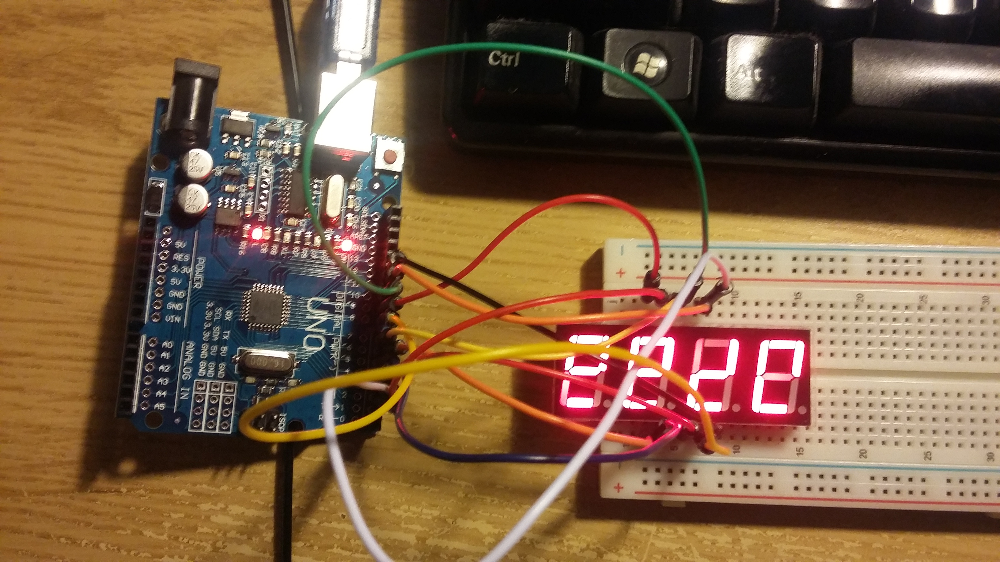

# Introduction

Nous allons nous inspirer du [tutoriel en ligne sur le site
d'arduino](https://create.arduino.cc/projecthub/SAnwandter1/programming-4-digit-7-segment-led-display-2d33f8).

# Matériel

* Un arduino UNO
* 11 cables
* Un afficheur 4 digits 7 segments

# Logiciel

Le code du tutoriel a été adapté pour permettre une compilation en dehors de
l'environnement de développement, sur le dépot github utilisé précédemment,
branche `4-digit-7-segments`.

Notez que comme des fonctions propres au kit de développement Arduino sont
utilisées, le `Makefile` est de fait plus complexe que dans le cas du simple
clignottement de LED précédent.

TODO: expliquer un peu plus clairement ces histoires de bibliothèque Arduino et
ce que cela implique.

# Montage

Suivez le schéma de cablage proposé sur le lien précédent.


# Compilation et envoi

```
$ make
```

# Résultat



TODO: Comprendre ce que fait le code, car je ne l'ai même pas lu ...

