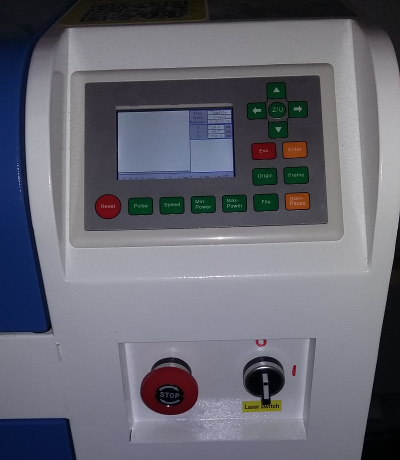
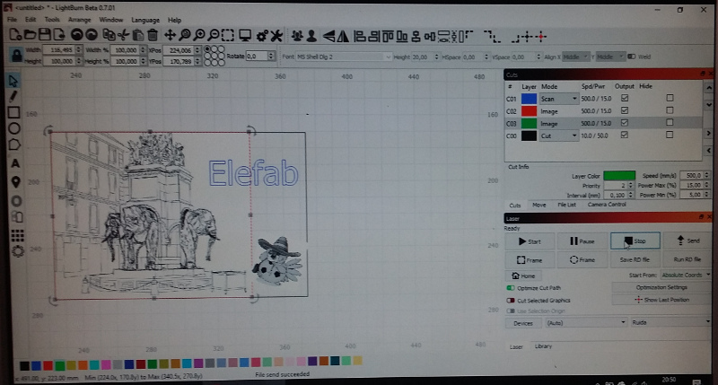
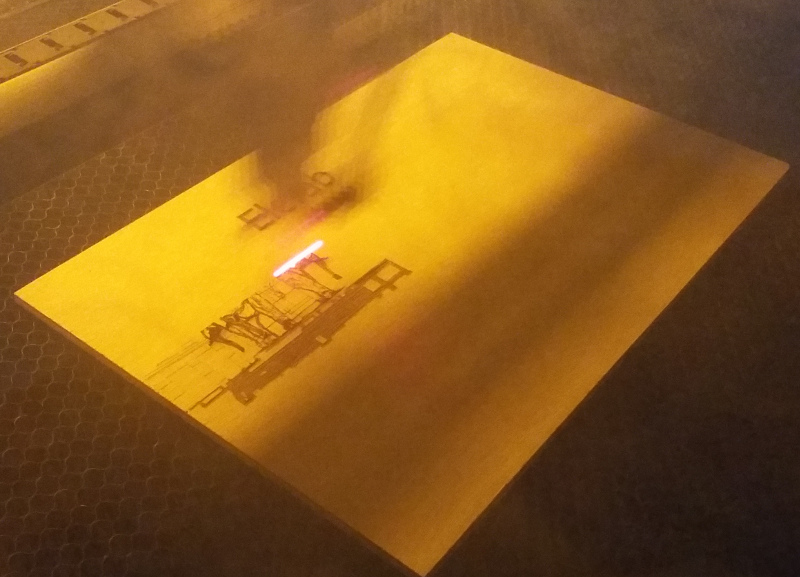

# Introduction à la découpe laser

Cette introduction a été animée par Anthony le 3 mai 2018.

# Présentation de la machine

La découpeuse laser est principalement constituée d'une armature en tôle,
ainsi que d'un module de refroidissement.

Un capot avec des vitres teintées protège les yeux des intervenants du contact
direct avec le laser lors de son fonctionnement. Ce capot est escamotable afin
de pouvoir d'une part régler la machine et d'autre part positionner
correctement le matériel sur lequel on va travailler.

Sous le capot, nous avons une partie mobile sur lequel est placé un jeu de
miroir et de lentilles sur lequel arrive le laser. Cette partie mobile peut se
déplacer sur 3 axes.

Le laser n'est en réalité pas situé directement sur la partie mobile, mais
déporté dans la partie bleue arrière supérieure de la machine. Un capot en
tôle est escamotable - protégé par des serrures et un jeu de clés - permettant
de protéger l'ensemble. Le laser est composé d'un tube dans lequel circule un
circuit d'eau déminéralisée dont le module est situé sous la machine.

Il est nécessaire de démarrer le module de refroidissement avant même d'allumer
le laser car il y a un réel risque d'endommager le dispositif dans le cas contraire
(le remplacer coûterait entre 500 et 1000 euros).

Allumage de la machine: tourner le bouton rouge sur la console de la machine.
Le laser switch (bouton noir à coté) doit etre positionné sur off.

Le plateau de travail doit être alors vide afin que la machine puisse se
calibrer.

Il faut ensuite vérifier que la machine est bien connectée (usb ou ethernet)
avant de passer à la partie plus "logicielle" de l'utilisation.

# Logiciel

Il existe plusieurs logiciels permettant de piloter la machine:

* Lightburn (nouveau),
* RDWorks suite (d'origine chinoise, utilisé préalablement au fablab)

Lightbburn est payant, le fablab via anthony a prévu d'en acquérir une license.
C'est celui que nous utilisons dans le cadre de cette documentation.

## Mise en place des éléments

On commence par tracer un rectangle, car notre matériau en entrée est une
plaque de contreplaqué de 20x30cm, et on souhaite réaliser une découpe de 4
plaques de 10x15 dans laquelle on va pyrograver une image.

On associe une couleur à notre rectangle. Chaque couleur pourra avoir des
paramètres (puissance du laser par exemple) différents.

Le positionnement du rectangle sur la zone de travail est arbitraire.

Nous ajoutons ensuite les éléments suivants dans Lightburn:

* JPEG de la fontaine des éléphants que l'on redimensionne pour que cela tienne
  dans notre cadre précédent.

* un texte "Elefab".

Ci-après, notre projet dans Lightburn, une fois les éléments précédents ajoutés:

## Paramêtrage

On sélectionne ensuite le type d'action du laser sur nos objets:

* Cadre: en mode "cut" pour découper
* Texte Elefab: en mode scan pour pyrograver
* Image en mode "image", mode qui propose des filtres spécifiques

Un autre mode non utilisé dans notre cas est possible:

* scan+cut (gravure + découpe des contours)

Il faut maintenant s'intéresser à l'ordre d'exécution. La découpe du cadre doit être
effectuée à la fin du processus.

Un double click sur les élements ouvre la fenêtre permettant la
personnalisation des paramètres du laser.

### Parametres scan (texte)

Les principaux paramètres sur lesquels nous allons jouer sont les suivants:

* vitesse,
* puissance laser max,
* puissance laser min
* Line interval: c'est un peu la précision du laser, une valeur de `0,1mm` est
  correcte pour le scan du texte.

Quelques régles et conseils à respecter:

* Il ne faut jamais dépasser 80% en puissance max
* En mode scan, on peut mettre 20% en min et max.
* Toujours activer le paramètre "air assist"

En ce qui concerne le "Bidirectional scanning",cela dépend: pour des matériaux
sensibles, il peut etre intéressant de le désactiver, mais en général, on peut
le laisser actif.

* Scan angle: en général on le laisse à 0 degrés.
* Z offset: à laisser à 0, cela a un intéret si des matériaux ont des
  épaisseurs différentes sur le même plateau, mais risqué car le laser va
  bouger en Z.

* "scan all shapes at once" ou "scan shapes individually".

### Paramètre des images

Utiliser le mode preview donne une idée de ce qu'on va obtenir

Changer l'image mode dans les parametres permet de s'adapter, l'algorithme
`jarvis` pour des photos est un très bon choix.

On va sélectionner `Artkinson`, car en mode preview c'est encore l'algorithme qui
rend le mieux.

A savoir qu'avec le mode `grayscale` on peut faire des cartes en relief.

* speed 200 mm/sec
* Min / Max laser: il est nécessaire de faire divers essais, car cela dépend du
  matériau, difficile de se faire une idée pour le moment. De mémoire on a
  d'abord essayé avec `5 / 15 %`.

### Paramètre de coupe (cut)

* 10 mm/sec de vitesse
* 50% en puissance min et max

## Conclusions sur les paramètres

Il faut faire des essais, car il y a plusieurs paramètres sur lesquels jouer,
difficile d'avoir une recette de cuisine toute faite pour chaque situation.

Anthony nous indique en outre qu'avec ce qu'on a vu, on est à peine à 10% des
capacités du logiciel (lightburn). Tout reste encore à découvrir, donc.

# Calibration / essais et lancement

Avant cela, on nous montre la sortie du laser, et les miroirs qui réfléchissent
jusqu'à la buse et la lentille. La régle de base est la suivante: lorsque le
couvercle de la machine est ouvert, le laser doit impérativement être en
position off !

Le capot ouvert, on est en mesure de calibrer la machine, à commencer par
regler le Z (focus laser à 62,5mm):

* utiliser la cale en plastique pour calibrer la hauteur de buse.

* regler le `x` et le `y`: prendre 2 points de la plaque et s'assurer qu'on est
  droit.

On sélectionne le 0 du dessin avec l'icône appropriée dans lightburn, et on
positionne notre plaque sous le laser de positionnement (i.e. le laser rouge
toujours allumé quand la machine fonctionne).

On peut utiliser l'option "move to laser position" (menu arrange)

Ce n'est pas grave si le laser tape à coté de la matière, car la focale étant
réduite, il y a peu de risque de découper le fond de la tôle de la machine.

## Essais à blanc

* Nous pouvons utiliser l'option "Frame" pour s'assurer que la zone de travail
est cohérente.

* On peut faire start à blanc (i.e. en gardant le laser toujours en position
désactivée).

* Capot dorénavant fermé, activer temporairement le laser permet de faire des
essais.

* 200 en vitesse étant trop lent pour du scan, nous arrétons le processus et on
passe à 500 et 15% de la puissance de laser.

* à 15% et 500 mm/sec, le résultat est satisfaisant pour notre contreplaqué de 5mm.

A noter qu'il est bon de toujours vérifier qu'il y ait bien un flux d'air au
niveau de la buse. Un capteur est censé vérifier cela, mais vérifier à la main
ne fait pas de mal.

## Lancement réel

* Temps nécessaire estimé par Lightburn: 10 minutes.

* Travel speed à 500

* Mise en marche du laser et lancement (bouton play) dans Lightburn.

* Pour les images, en dessous de 10%, l'intensité du laser est trop faible,
  essayons plutôt 10% / 18%.

* Lors de nos diverses tentatives (arrêt / ajustements des paramètres /
  redémarrage), on peut supprimer le texte car on l'a déjà gravé lors de notre
  premier essai.

On s'apercoit que pour le dessin, le mode grayscale n'est pas terrible, on
arrete et on se remet en `Atkinson` qui donne un bien meilleur rendu. On peut
relancer laser arrété et réenclencher le laser la où on l'avait arrété.

Il faut aussi éviter de regarder lors de la découpe (cuts), car il y a des
risques de rebondissement du laser sur la structure.

# Fin / Résultat

Les paramètres de découpe sont peut être un peu forts, car les bords obtenus sont bien noirs.

Il faut attendre 5 à 10 minutes, puis

* couper la machine
* couper le circuit de refroidissement

Ceci afin de s'assurer que toutes les fumées ont bien été dissipées.

