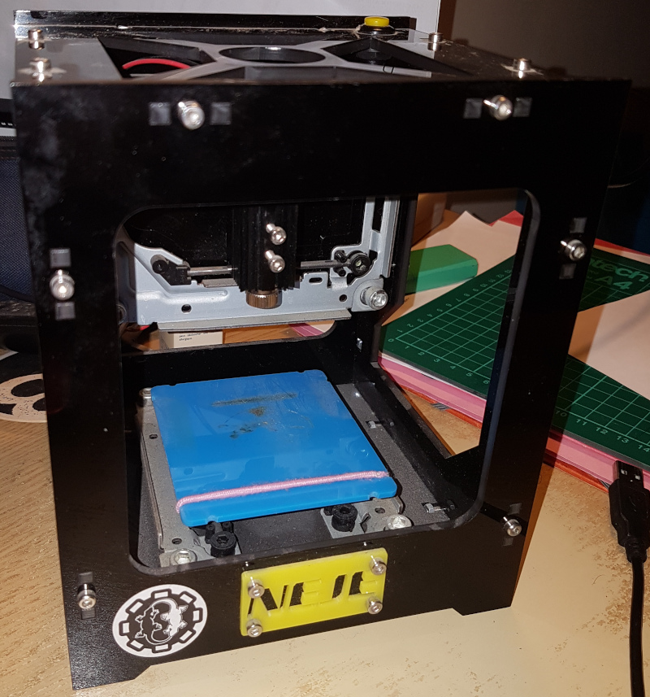
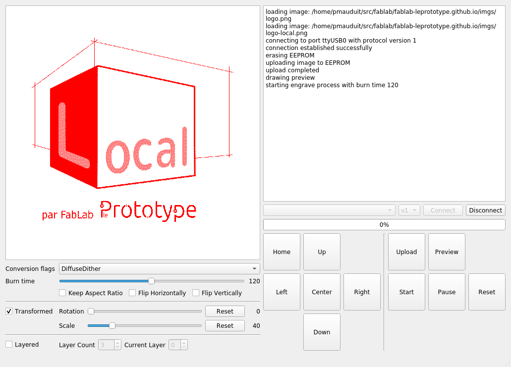
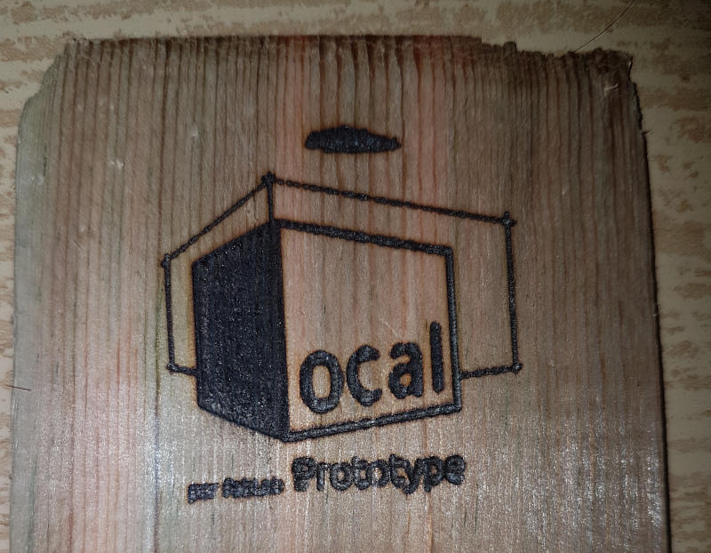

# Introduction

Cette machine a été concue pour des petits travaux de gravure à la laser. La
société produisant ces machines proposent des logiciels propriétaires pour
l'utiliser, toutefois il existe une solution libre dont les [sources sont
disponibles sur Github](https://github.com/camrein/EzGraver).

Nous allons donc utiliser EzGraver.

# Compilation

Simplement cloner le dépot et suivre les instructions définies dans le README.

Il suffit ensuite, une fois le `make install` effectué, d'aller dans le
sous-répertoire `EzGraverUi` et de lancer l'application.

# Présentation de la machine

Il s'agit d'une boite en plastique carrée avec un plateau se déplaçant d'avant
en arrière, le laser étant situé sur une partie mobile bougeant de gauche à
droite.

2 entrées USB sont nécessaires au fonctionnement, sur la droite de la machine:

* 1 première entrée USB rectangulaire mâle, servant à l'alimentation électrique
  des moteurs.

* 1 entrée USB de type mini-usb, reliée à l'ordinateur, offrant une interface
  série, et permettant le pilotage par le logiciel

# Interface utilisateur de EzGraver

Cf capture ci-après:

Un click sur la zone de gauche permet de charger une image, nous pouvons
ensuite configurer l'algorithme de gravure parmi 3, ainsi que le temps de
brûlure du laser, et diverses options de taille et de mirroir sur l'image
chargée.

Note: il est possible d'effectuer plusieurs couches, mais cela nécessite de
procéder couche par couche et de renvoyer l'image à chaque fois dans le
firmware de la machine via le bouton "upload" (i.e. il faudra sélectionner la
première couche sur "current layer", clicker sur upload, puis la deuxième, et
ainsi de suite).

Une fois nos réglages effectués, il est possible de lancer la gravure, en:

1. se connectant sur la machine (sélection de l'interface série, protocole v1,
   puis bouton "connect")
2. Clicker sur "upload"
3. Clicker sur "start"

# Conclusions

Ci-après le résultat de la gravure obtenu avec la capture d'écran précédente:

La surface de travail est très réduite (à peine quelques centimêtres). Aussi,
pour des travaux plus importants, il vous sera sans doute nécessaire d'utiliser
la [découpe laser](/decoupe-laser) du fablab.

